# M5Stack MultiApp Advanced

  ### Using this app, M5Stack can run all included apps without reflashing/rebooting
   #### - This is the continued development of the original M5Stack MultiApp firmware
   #### - This project is made on PlatformIO IDE
   #### - With some minor work it can be adapted to other IDE's like VisualStudio+VisualMicro or Eclipse.

- This project use modifed M5Stack M5StackSAM and EspAudio libraryes from project local storage.

  
# Installing and Compiling the firmware
### First, you must install the necessary tools and prepare the IDE environment
- Download (and unzip) this repository
- Download and Install Visual Studio Code https://code.visualstudio.com/
- Install the PlatformIO Extension
- Install ESP32 Framework on PlatformIO
- Apply the PlatformIO Patch
  + This Patch will fix ESP-IDF bug - ButtonA Problems when Wifi is connected
  + This Patch will allow to upload large firmwares into M5Stack by sacrificing some SPIFFS area
- Open the MultiApp Project folder on PlatformIO
- Click the BUILD button 
  + This will build and Flash the firmware to M5Stack connected to your PC USB
- To use Local Ota to flash your M5Stack
  + The M5Stack must be connected to the same network as your PC
  + In the project "platformio.ini" file set "upload_port = [your M5StackIP]"

## The project include:
- Applications
	+ Dual Channel Oscilloscope
		+ Signals
			+ Pin 35 Channel 1
			+ Pin 36 Channel 2
			+ Pin 26 Signal Generator
		+ Oscilloscope Menu Structure:
			+ Stop / Run frame
			+ Sensitivity for each channel:
				+ 50mV, 100mV, 200mV, 500mV, 1V per division
			+ Sample Rate
				+ 0.3ms, 0.6ms, 1ms, 2ms, 5ms, 10ms, 20ms, 50ms, 0.1s, 0.2s, 0.5s, 1s, 2s, 5s, 10s per division
		+ Channel modes for each channel
      		+ Normal, Inverted, Off
		+ Offset for each channel
		+ Trigger Switch
			+ Trigger from Channel 1 or Channel 2
		+ Trigger Mode
			+ Auto, Normal, Scan
			+ Trigger Level 0 - 100 %
		+ Trigger Edge
			+ Rising (UP)
			+ Falling (DN)
		+ Internal Signal Generator mode
			+ Wave signal
			+ Square signal
			+ Triangular Signal 1
			+ Triangular Signal 2
			+ Signal Generator OFF
		+ Exit Oscilloscope App
    + WebRadio
      + Support Volume Adjustment
      + Support Stations change on the fly
      + Long press NEXT key to exit from Radio App
      + Display Volume Level
      + Display Data buffer state
      + If the connection is lost or the buffer runs empty, will try to recover the connection. 
      + If the connection can't be recovered, will connect to the next station on the list
      + Can play MP3 streams
      + Web Radio streams are stored on SD Card on "RadioStations.txt" file
      + Support theoretically unlimited station list
          + The stations must be defined on separate lines as follow: "StationName=StationLink;  
    + Weather Station
      + Display Current Weather
      + Display 5 days weather forecast
      + Display Current Weather details
      + Display 2 days and 2 nights forecast details
      + Support multiple display languages
        + The City, Country, Language and WUnderground Api key
        Must be defined on WeatherParams.txt file on SD card
    + WebServer with web based SD File manager
      + Can run in the background once started
      + You can use other apps when the webserver is running
      + List SD Folders
      + Create Folder
      + Delete Folder
      + Download files
      + Upload Files
      + Delete Files
      + Display Files Content (images, text, etc...)
    - SD Browser that support
      + Display Jpeg files on the screen
      + Resize Jpeg to fit to screen size
      + Play MP3 Files using Mp3 Player App
      + Display File properties for the files that can't be open with included apps
    - Tools list
      + Wifi Packet Monitor
      + Wifi Scanner
      + I2C Scanner
      + DHT Sensor reader
        + Support any DHT sensor type
      - Stopwatch
    - Games (just for fun)
      + Tetris
      + Flappy Bird
      + Space Shooter
  - Return (to menu root)
- System
  + System Informations
    + CPU Frequency, Number of cores, Chip Revision, Flash Speed, Current Free RAM space, Wifi MAC address, Wifi IP Address, Wifi current Mode
    + Minimum FREE heap (RAM) since the device was started, Flash Size, SPIFFS Size, SPIFFS used space, SD Card Type, SD Card Size, SD Card used space
	+ Wifi Connection
		+ Wifi Smart Config
		+ Wifi WPS PushButton
		+ Wifi WPS PIN Code
		+ Wifi STA: Set Wifi to STATION (Reciever) mode
		+ Wifi AP: Set Wifi to ACCESS POINT (Sender) mode
		+ Wifi OFF
	+ Display Backlight Settings
		+ Set and save Display backlight so the settings survive reboot and flash
+ Sleep
	+ Puth the device into Sleep mode
	+ The device can power back on by pressing ButtonB or reset key
  
## This Firmware also support:
+ Local OTA flashing
	+ Set the M5Stack IP as Upload Port on PlatformIO then you can flash the device over WIFI
+ Remote OTA Update
	+ Will check the server for new version at startup
	+ If a new version was found, will update to new version
  
  
  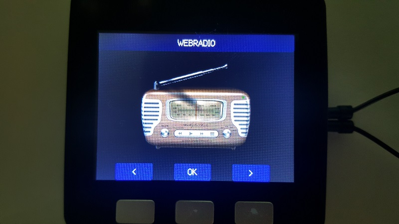
  
  
  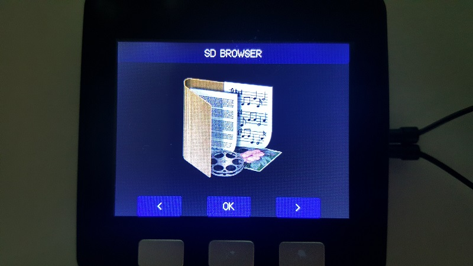
  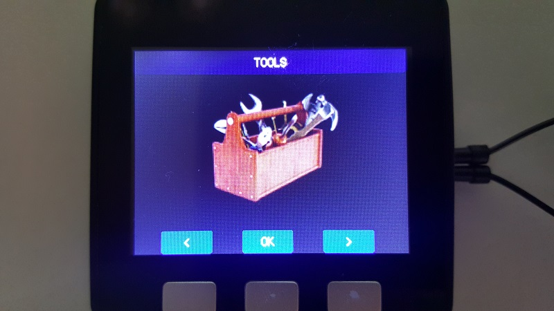
  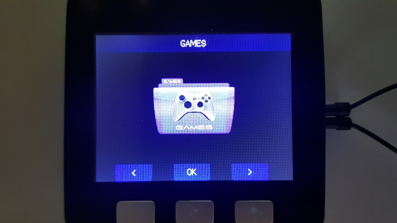
  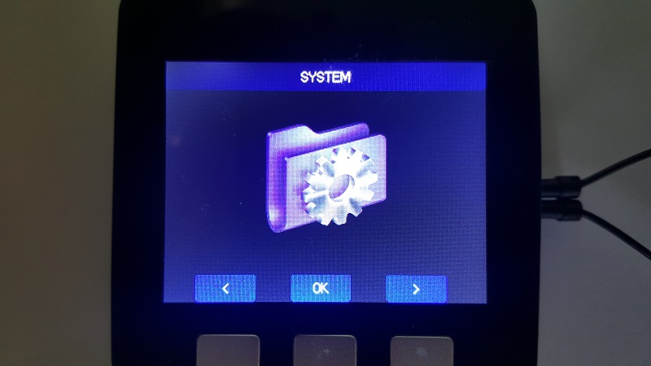
  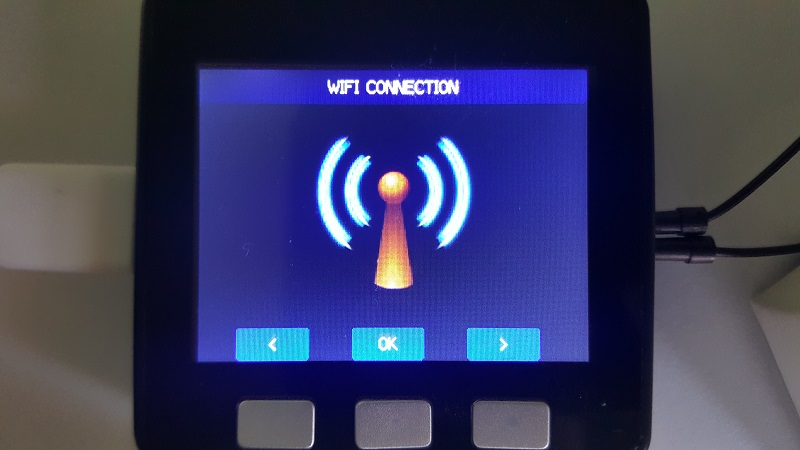
  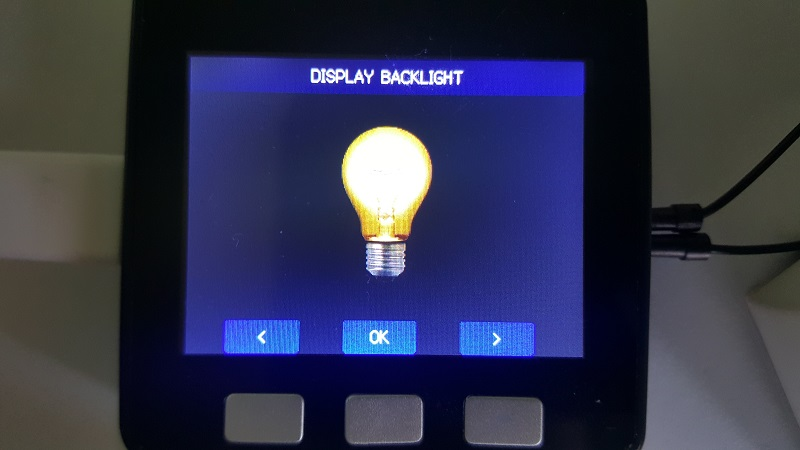
  
   
   
   
   
  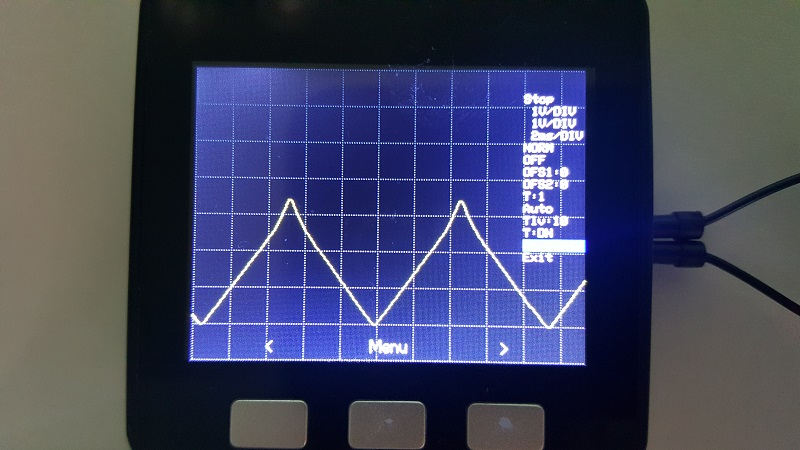
  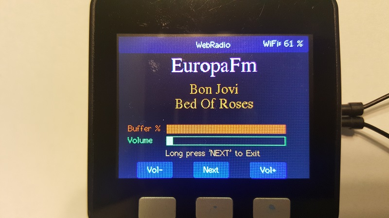
  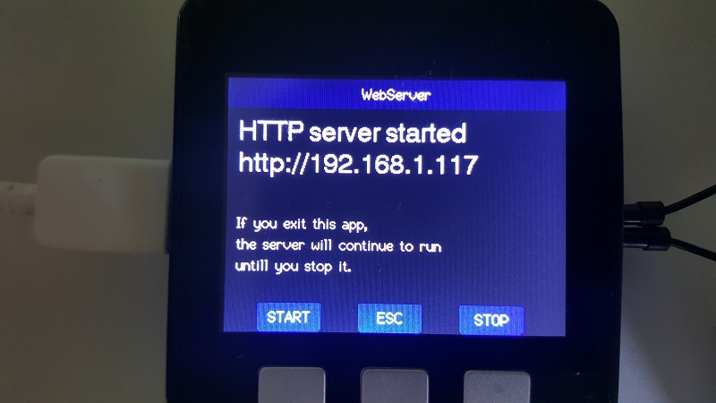
  
   
  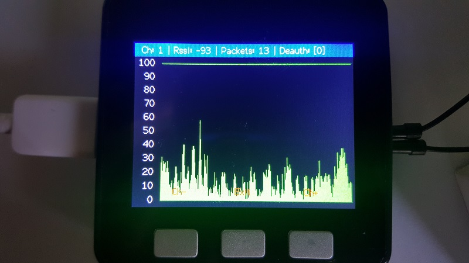
  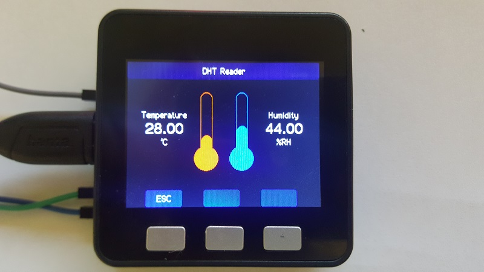
  
  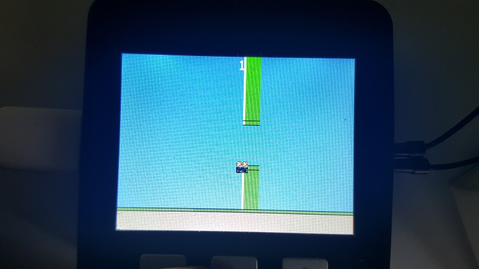
  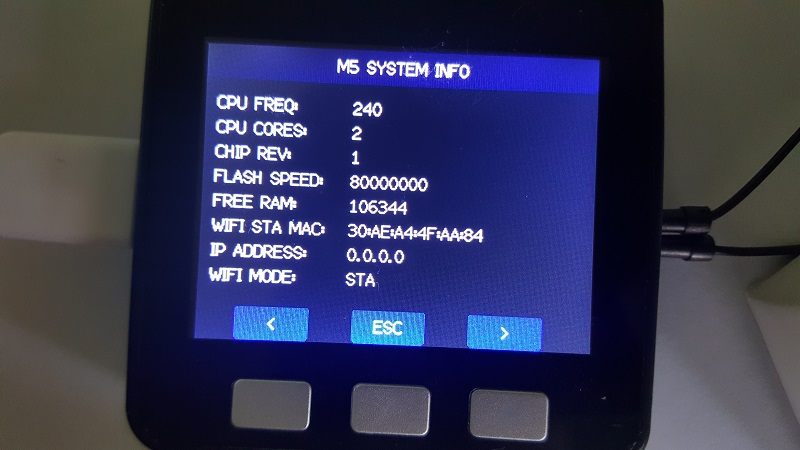
  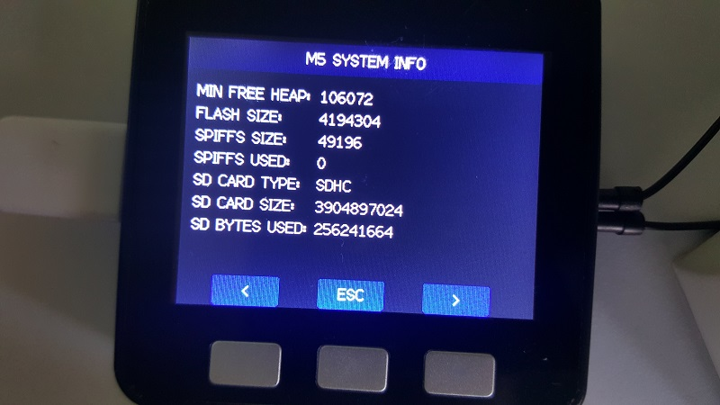
  
  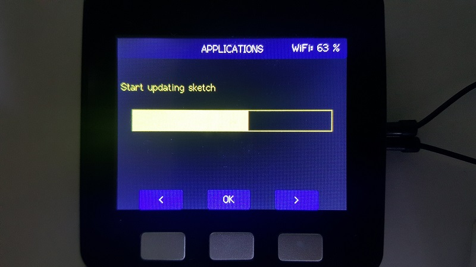
  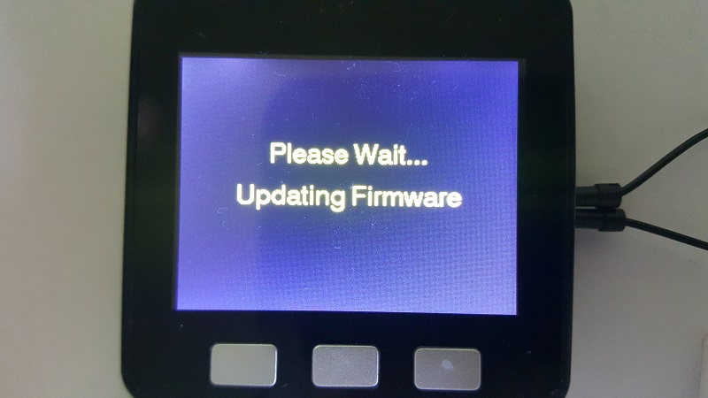
